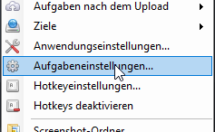
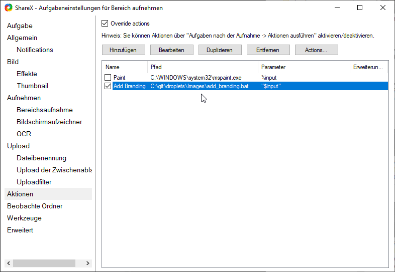
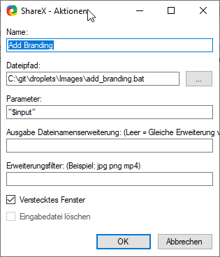

# Scripts
- ``add_branding.bat`` does add needle color gradient to images:  

# Prerequisite
Install [imagemagick](https://imagemagick.org/script/download.php), make sure to install to ``PATH``

# Usage
Drag drop images on matching bat files to process them
You can even drop multiple files at once

## Use with ShareX
1) Open tasks
2) Select the task you want to run a post processing action on
3) Select actions
4) Create a new action and add the path to the batch file you want to process (select hidden process to not show the commandline window)
5) Enable ``Run Action`` in the ``Task`` section 
6) Done

